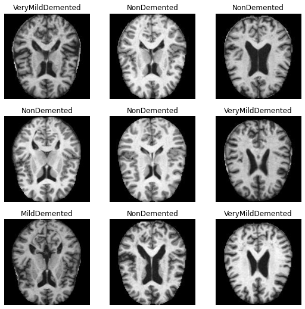
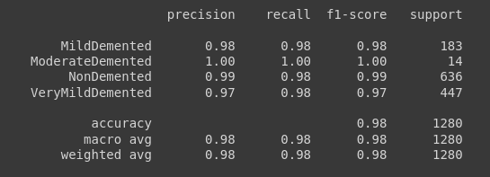

# Alzheimer-Disease-Detection
The project aims to classify between 4 classes of Alzheimer's Disease using Transfer Learning. It uses ResNet34 Model as a base model and trains on label data.
It uses fast.ai library built on top of PyTorch Library.


### To setup the project:
```
$ conda create -n alzheimer_project
$ conda activate alzheimer_project
# Install appropriate pytorch version.
# for example. http://download.pytorch.org/whl/cpu/torch-1.0.0-cp36-cp36m-linux_x86_64.whl
$ pip install http://download.pytorch.org/whl/cpu/torch-1.0.0-cp36-cp36m-linux_x86_64.whl
$ pip install fastai --upgrade
```

### Example of the Dataset


### Result

